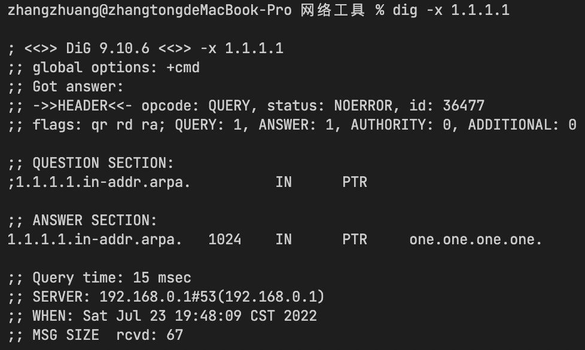

## dig 解决的问题
* 查看DNS记录

---

## 用法
`dig -x 1.1.1.1` 
查询1.1.1.1对应的域名
效果：
> 

 

`dig www.baidu.com any` 
查询关于 www.baidu.com 的所有DNS记录
效果：
> 

 

`dig @1.1.1.1 www.baidu.com` 
指定到DNS服务器1.1.1.1查询关于www.baidu.com的DNS记录
效果：
> 